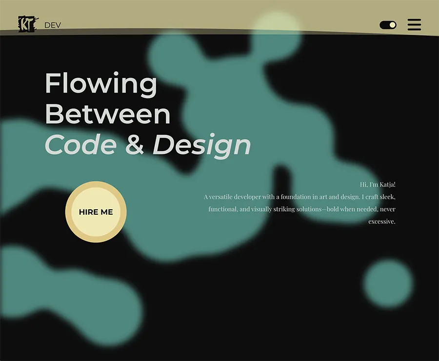

# KT Dev Portfolio



A personal front-end portfolio showcasing selected web, interaction, and graphic design work. Built with accessibility, responsiveness, and performance in mind. Includes theme-aware UI, animated menu backdrop, and optimized media loading.

## 📍 Live Site

[Portfolio Website](https://katjaturnsek.github.io/portfolio/)

## 💻 GitHub Repository

[https://github.com/KatjaTurnsek/portfolio](https://github.com/KatjaTurnsek/portfolio)

## 📝 Description

This project presents featured work with a clean, component-based layout. It focuses on semantic HTML, structured CSS with custom properties (themes), and progressive enhancement in JavaScript for animation and loading states.

### Key Features

- Fullscreen menu with animated wave background (canvas + fallback images)  
- Light/Dark theme via CSS variables  
- Responsive, accessible layout with semantic headings and clear focus states  
- Case-study sections with alternating text/image columns  
- Optimized images using `<picture>`, `srcset`, `sizes`, lazy loading, and blur-in effect  
- Global GSAP loading wave and per-image 3-dot mini loader  
- Reduced-motion support and color-contrast awareness  
- DRY CSS structure (`variables.css`, `styles.css`, `loader.css`, `reset.css`)

## 🔧 Built With

- HTML5  
- CSS3 (Custom properties, responsive layout)  
- JavaScript (ES Modules)  
- GSAP (GreenSock) + MorphSVGPlugin

## 📦 Installation / Local Use

To run the project locally:

1. Clone the repository:
   ```bash
   git clone https://github.com/KatjaTurnsek/portfolio.git

2. Open index.html in your browser (no build step required).

This is a static front-end project with no backend or external API requirements.

## 📁 Project Structure (excerpt)

```text
assets/
  images/
  css/
    variables.css
    styles.css
    loader.css
    reset.css
  js/
    loader.js
    images.js
index.html
```

## ♿ Accessibility & Performance

- Semantic HTML, descriptive alt text, logical heading order
- Visible focus states and keyboard navigability
- Respects prefers-reduced-motion
- Optimized images and lazy loading to reduce payload

## 🤝 Contributing

Thanks for your interest in improving this project! Contributions are welcome — from typo fixes to new features.

### 1) How to Propose Changes

1) Fork the repository and create a branch:

git checkout -b feat/your-short-title
#### or: fix/..., docs/..., style/...

2) Run locally - Use a local server (e.g., VS Code Live Server) so ES modules load correctly.
3) Make your changes following the guidelines below.
4) Commit with clear messages (Conventional Commits recommended):

feat(case-study): unify mobile list spacing
fix(menu): adjust hamburger color over teal animation (dark theme)
docs(readme): add contributing section

5) Open a Pull Request to main with:

- A concise description of the change and the “why”
- Before/after screenshots (if UI)
- Any accessibility/performance notes (Lighthouse/Axe where relevant)

### 2) Code Style & Conventions

#### HTML

- Use semantic elements and a logical heading order.
- Provide meaningful alt text and accessible labels (aria-*) as needed.

#### CSS

- Use design tokens from variables.css (colors, typography, spacing). Avoid hard-coded values when a token exists.
- Keep it DRY; group rules by section; prefer logical properties (margin-block, padding-inline) where sensible.
- Respect theming: override via body.light-theme / body.dark-theme.
- Mobile breakpoint: max-width: 850px.
- Maintain visible focus and WCAG AA contrast.

#### JavaScript

- ES Modules only; keep dependencies minimal.
- For animations, follow the existing GSAP pattern and respect prefers-reduced-motion.
- Avoid blocking the main thread; keep features progressive and lightweight.

### 3) Images & Assets

- Optimize images (WebP/JPG/PNG).
- Provide multiple sizes when used in responsive <picture> blocks.
- Use descriptive file names and alt text.

### 4) Accessibility & Performance Checklist

- Before submitting a PR, please verify:
- Keyboard navigation works; focus is visible and logical.
- Color contrast meets WCAG AA.
- Animations reduce/disable with prefers-reduced-motion.
- Images are optimized; no oversized assets added.
- (Optional) Run Lighthouse (Desktop & Mobile) and include scores if your change impacts UX.

### 5) Issue Reports

- Search existing issues first.
- Open a new issue with steps to reproduce, expected vs actual behavior, and screenshots if applicable.

### 6) License / Attribution

By contributing, you agree your code will be licensed under the project’s license (MIT unless stated otherwise).
Ensure you have rights to any assets you add and include proper attributions (fonts, icons, images).

## 🙋‍♀️ Author

** Katja Turnšek **
Frontend Development Student
[Portfolio Website](https://katjaturnsek.github.io/portfolio/)
